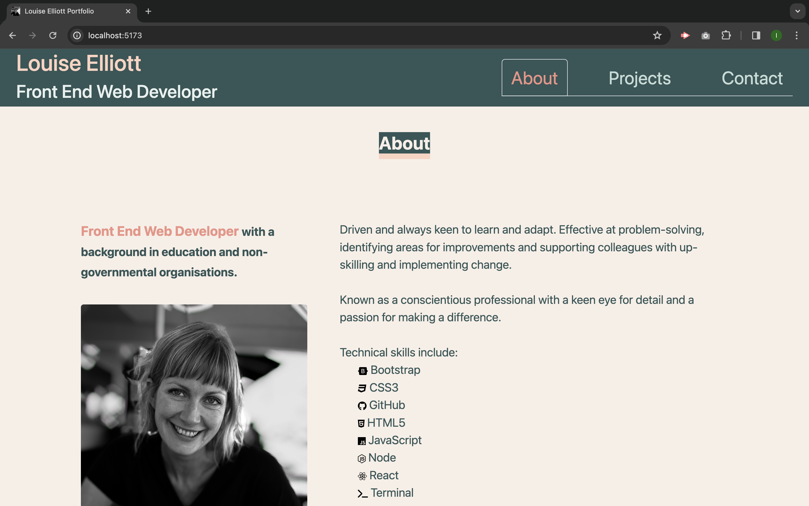

# React Portfolio

## Contents
[Description](#description) 
[Installation](#installation) 
[Usage](#usage) 
[License](#license) 
[Contributions](#contributions) 
[Testing](#testing) 
## Description
This is an online portfolio that can be easily used in the future. It features an about page, with a brand statement, headshot and professional experience summary, a projects page, showing a carousel of key projects to date taken from a json file that can be added to as further projects are completed and a contact section complete with links to external sites and a contact form.
Styling is consistent throughout and mobile-first design features include responsive elements throughout, with viewport width and height used to set properties, and REM used for font sizing.
Deployed application: https:/louise-elliott-work.github.io/react-portfolio
Screenshot of the home page: 
## Installation
Run the following command in order to install dependencies: npm i
## Usage
If you are interested in using this template or would like a modified version of this site made for you, please get in touch.
## License
2024 Louise Elliott
MIT License
Permission is hereby granted, free of charge, to any person obtaining a copy of this software and associated documentation files (the "Software"), to deal in the Software without restriction, including without limitation the rights to use, copy, modify, merge, publish, distribute, sublicense, and/or sell copies of the Software, and to permit persons to whom the Software is furnished to do so, subject to the following conditions: The above copyright notice and this permission notice shall be included in all copies or substantial portions of the Software. THE SOFTWARE IS PROVIDED "AS IS", WITHOUT WARRANTY OF ANY KIND, EXPRESS OR IMPLIED, INCLUDING BUT NOT LIMITED TO THE WARRANTIES OF MERCHANTABILITY, FITNESS FOR A PARTICULAR PURPOSE AND NONINFRINGEMENT. IN NO EVENT SHALL THE AUTHORS OR COPYRIGHT HOLDERS BE LIABLE FOR ANY CLAIM, DAMAGES OR OTHER LIABILITY, WHETHER IN AN ACTION OF CONTRACT, TORT OR OTHERWISE, ARISING FROM, OUT OF OR IN CONNECTION WITH THE SOFTWARE OR THE USE OR OTHER DEALINGS IN THE SOFTWARE.
## Contributions
If you have ideas for improvement, get in touch!
## Questions
To view the repo relating to this tool, visit https://github.com/louise-elliott-work.
For any questions relating to this tool, contact louise.elliott.work@gmail.com.
